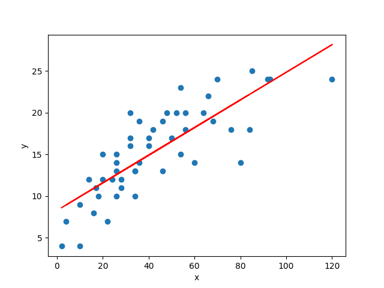

# Linear Regression

***

## Introduction 

----
Linear regression is a linear approach for modelling the relationship between a scalar response and one or more explanatory 
variables (also known as dependent and independent variables). In machine learning framework, linear regression algorithm 
is one of the fundamental supervised machine-learning algorithms due to its relative simplicity and well-known properties. 
In this repository, we archived some linear regression projects.

| Project Name | Description |    
|---|---|
| 📺 [Linear Regression from Scratch]() | We implement the simple linear regression from scratch and use some data generated by random.  | 
| ⛽️ [Linear Regression of CO2 emission]() | In this project, we study a simple linear regression using the machine learning library, scikit-learn. Our analysis uses the dataset about model-specific fuel consumption ratings and estimated carbon dioxide emissions for new light-duty vehicles for retail sale in Canada. |
| 🍷 [Multiple Linear Regression (soon)]() | |    

