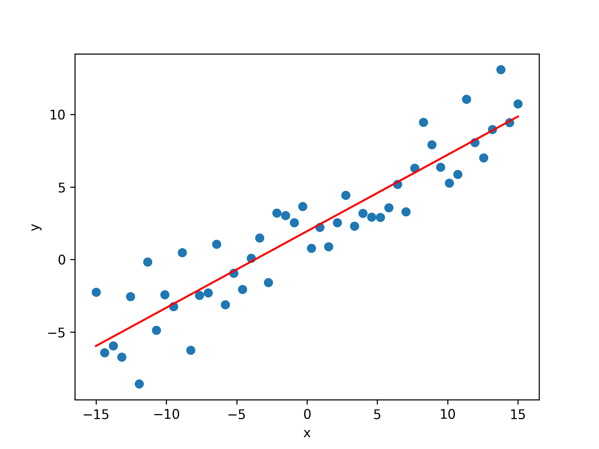

# Regression Models
---

## Introduction 

In this repository, we study Regression Models that relate an outcome to a set of predictors of interest using linear assumptions. Regression models are one of most important statistical analysis tool in data scientists' toolkits. Linear Regression is the most common form of regression analysis. It assumes a linear approach for modeling the relationship between a scalar response and one or more explanatory variables (also known as dependent and independent variables). In machine learning framework, linear regression algorithm is a fundamental supervised machine-learning algorithm due to its relative simplicity and well-known properties.

| Project Name | Description |    
|---|---|
| 📺 [Linear Regression from Scratch](https://github.com/williamjouse/Linear-Regression/blob/main/notebooks/01-Linear_regression_from_scratch.ipynb) | We implement the simple linear regression from scratch and use some data generated by random.  | 
| ⛽️ [Linear Regression of CO2 emission](https://github.com/williamjouse/Linear-Regression/blob/main/notebooks/02-Linear_regression_CO2emission.ipynb) | In this project, we study a simple linear regression using the machine learning library, scikit-learn. Our analysis uses the dataset about model-specific fuel consumption ratings and estimated carbon dioxide emissions for new light-duty vehicles for retail sale in Canada. |
| 🍷 [Multiple Linear Regression](https://github.com/williamjouse/Regression-Models/blob/main/notebooks/03-Multiple_Linear_Regression.ipynb) | In this project, we implement a multiple linear regression model to predict sales based on data about TV, Radio, and Newspaper advertisements. |   
| 🏙️ [Analysis of Residuals](https://github.com/williamjouse/Regression-Models/blob/main/notebooks/04-Analysis_residuals.ipynb)| |
| 🚂 [L1 and L2 Regularization (soon)]| |
| ✈️ [Generalized Linear Models (soon)]| |
| 🚀 [Polynomial Regression (soon)]| |

